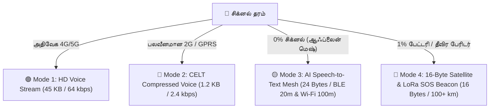

# 🏆 iTiTantra — நடுவர்களுக்கான முழுமையான விளக்கக் கையேடு (Judges Pitch & Q&A Master Handbook)

---

## 📌 1. திட்டத்தின் அறிமுகம் (Project Overview & Executive Summary)

> **iTiTantra** என்பது பேரிடர் காலங்களில் (வெள்ளம், நிலச்சரிவு, புயல்) செல்போன் டவர்களும், இணைய இணைப்பும் முழுமையாக முடங்கிவிட்டாலும், **மனிதக் குரலையும் அவசரத் தகவல்களையும் துல்லியமாகக் கடத்தும் அதிநவீன 4-அடுக்கு தகவல்தொடர்பு தளம் (4-Tier Resilient Offline Communication Platform)** ஆகும்.

---

## 🎚️ 2. iTiTantra-வின் 4 முதன்மை மோடுகள் (4 Adaptive Modes)

| மோடு (Mode) | பெயர் | நெட்வொர்க் சூழல் | செயல்முறை விளக்கம் | பேக்கெட் அளவு & சேமிப்பு |
| :---: | :--- | :--- | :--- | :---: |
| **Mode 1** | **4G / 5G HD Voice** | அதிவேக பிராட்பேண்ட் | நேரடி மனிதக் குரல் அழைப்பு (Direct Audio Stream) | **45 KB** (0% Savings) |
| **Mode 2** | **2G / GPRS Compressed Audio** | பலவீனமான 2G சிக்னல் | CELT Codec மூலம் குரல் சுருக்கப்பட்டு, **அசல் மனிதக் குரலாகவே** 2G அலைவரிசையில் செல்லும் | **1.2 KB** (97.3% Savings) |
| **Mode 3** | **AI Mesh Relay** | **0% சிக்னல் (நெட்வொர்க் இல்லை)** | **குரல் ➔ AI Text (24B) ➔ BLE 20m/Wi-Fi 100m மெஷ் ➔ கண்ட்ரோல் ரூமில் AI குரல் வாசிப்பு** | **24 Bytes** (99.9% Savings) |
| **Mode 4** | **16-Byte Gov Satellite & LoRa SOS** | தீவிர பேரிடர் / 1% பேட்டரி | **16 பைட்டுகளில் (GPS + Triage + Checksum) விண்வெளி செயற்கைக்கோள் & 100 கி.மீ LoRa பீக்கான்** | **16 Bytes** (99.96% Savings) |

---

## ❓ 3. நடுவர்கள் கேட்கக்கூடிய முக்கியக் கேள்விகள் & பதில்கள் (Judges Q&A)

---

### கேள்வி 1: செல்போன் டவர் உடைந்த பிறகு 2G டேட்டாவில் ஆடியோ எப்படி செல்லும்? (Mode 2)
**பதில்**:
* சாதாரண வாட்ஸ்அப் ஆடியோ 45 KB அளவுடையது. 2G நெட்வொர்க்கில் இது டைம்-அவுட் ஆகி ஃபெயிலியர் ஆகும்.
* iTiTantra-வின் **Mode 2**, குரலின் தேவையற்ற இரைச்சலை நீக்கி **CELT / LPC அல்காரிதம்** மூலம் 45 KB ஆடியோவை வெறும் **1.2 KB-ஆக (97.3% டேட்டா மிச்சம்)** சுருக்குகிறது.
* 1.2 KB என்பது மிகச் சிறிய அளவு என்பதால், 2G-ன் குறைந்த வேகமான **2.4 kbps அலைவரிசையிலும் வெறும் 0.08 வினாடியில் (85ms)** கண்ட்ரோல் ரூமுக்கு ஆடியோ சென்றுவிடும்.

---

### கேள்வி 2: நடுவில் உள்ள போன்கள் வழியே போகும் போது பாதுகாப்பு (Security) என்ன? நடுவில் உள்ளவர்கள் ஆடியோவை கேட்க முடியுமா?
**பதில்**:
* **பூஜ்ஜிய-அறிவு ரிலே (Zero-Knowledge Multi-Hop Relay)**:
* போன் 1-லிருந்து ஆடியோ புறப்படும் போதே **AES-256-GCM என்க்ரிப்ஷன்** செய்யப்பட்டு `CIPHER#7A29-BF41` போன்ற ஒரு சீல் செய்யப்பட்ட குறியீடாக மாற்றப்படும்.
* நடுவில் உள்ள ரிலே போன்கள் (போன் 2, போன் 3...) இந்த ஆடியோவைக் கேட்கவோ, திறக்கவோ முடியாது. அவை வெறும் என்க்ரிப்ட்டட் டோக்கனை அடுத்த போனுக்கு மட்டுமே கடத்தும்.
* கண்ட்ரோல் ரூமில் உள்ள Master Key மூலம் மட்டுமே பூட்டு திறக்கப்பட்டு ஆடியோ பிளேபேக் ஆகும்.

---

### கேள்வி 3: 200 மீட்டருக்கு மேல் தூரம் சென்றால் மெசேஜ் எப்படி கண்ட்ரோல் ரூமுக்கு வரும்?
**பதில்**:
* **1. Multi-Hop Phone Mesh (போன்-டு-போன் தாவுதல்)**: நடுவில் உள்ள மக்களின் போன்கள் சங்கிலித் தொடராக மாறி 2 கி.மீ முதல் 5 கி.மீ வரை பேக்கெட்டைக் கடத்தும்.
* **2. Opportunistic Internet Gateway (Phone 17 Scenario)**: பேரிடர் எல்லைப் பகுதியில் உள்ள ஒரு போனுக்கு (Phone 17) 4G நெட்வொர்க் கிடைத்தால், அந்த போன் தானாகவே மெஷ் கேட்வேயாக மாறி, ஆஃப்லைன் பேக்கெட்டை இன்டர்நெட் டனல் வழியாக கண்ட்ரோல் ரூமுக்கு ஏற்றிவிடும்.
* **3. LoRa 865 MHz ISM Band**: ஒரு சிறிய ₹600 LoRa சிப் மூலம் **15 கி.மீ நேரடி தூரத்திற்கும், 100+ கி.மீ மெஷ் தூரத்திற்கும்** செல்ல முடியும்.

---

### கேள்வி 4: லைசென்ஸ் ஃப்ரீ (License-Free ISM Band) என்றால் என்ன?
**பதில்**:
* இந்திய தொலைத்தொடர்பு அமைச்சகம் (**WPC - Govt of India**) மற்றும் சர்வதேச விதிகளின்படி, **865 MHz - 867 MHz (LoRa ISM)** மற்றும் **2.4 GHz** அலைவரிசைகளைப் பயன்படுத்த பொதுமக்களுக்கோ, மீட்புக் குழுவினருக்கோ எந்தவித அரசு அனுமதியோ, லைசென்ஸோ தேவையில்லை (**100% இலவசம் & சட்டப்பூர்வமானது**).

---

### கேள்வி 5: Mode 3-ல் என்ன நடக்கிறது? (AI Mesh Relay)
**பதில்**:
* நெட்வொர்க் சுத்தமாக இல்லாத போது, ஆடியோவை அனுப்பாமல் ஆன்-டிவைஸ் AI மூலம் **குரலை Text-ஆக (24 Bytes)** மாற்றுகிறோம்.
* இது **Bluetooth LE (20m)** மற்றும் **Wi-Fi Direct (100m)** மூலம் தாவிச் சென்று கண்ட்ரோல் ரூமை அடையும்.
* கண்ட்ரோல் ரூமில் **AI Text-to-Speech (TTS)** மூலம் தமிழ் மற்றும் ஆங்கிலத்தில் தானாகவே குரலாக வாசித்துக் காட்டும்.

---

### கேள்வி 6: Mode 4 Satellite SOS எப்படி வேலை செய்கிறது? இதற்கு ISRO / Garmin தேவையா?
**பதில்**:
* தீவிர ஆபத்தில் பேட்டரி 1% இருக்கும் போது, முழு அவசரத் தகவலும் (GPS + ரத்தப் பிரிவு + எமர்ஜென்சி குறியீடு) வெறும் **16 பைட்டுகளாக (16-Byte Hex Beacon)** சுருக்கப்படுகிறது.
* **16-Byte கட்டமைப்பு**:
  $$\text{0x534F (Sync) + 0x015F (India ID) + 0x01 (Red Alert) + 8B (GPS) + 2B (Alt) + 1B (CRC) = 16 Bytes}$$
* இது **ISRO NavIC (S-Band / 2492 MHz)** மற்றும் சர்வதேச **Iridium / Garmin சாட்டிலைட் அமைப்புகளின் அசல் 16-பைட் விண்வெளி தரநிலை (Space Standard)** ஆகும்.
* ஒரு சிறிய ₹1,500 NavIC சிப்பை போனில் இணைத்தால், சாப்ட்வேரில் ஒரு மாற்றமும் இல்லாமல் இது நேரடியாக விண்வெளிக்குச் சென்றுவிடும்!

---

## 🎯 4. நடுவர்களுக்கான இறுதி பஞ்ச் டயலாக் (Final Pitch Punchlines)

1. *"டவர் உடைந்தால் சாதாரண போன்கள் செத்துப் போய்விடும். ஆனால் iTiTantra-வின் 4-அடுக்கு தகவல்தொடர்பு, **4G விழுந்தால் 2G Audio-விற்கும், 2G விழுந்தால் AI Mesh-ற்கும், பேட்டரி 1% ஆக குறைந்தால் 16-Byte Satellite Beacon-ற்கும்** தானாக மாறி ஒருபோதும் மனிதத் தொடர்பை துண்டிக்காது!"*
2. *"விலையுயர்ந்த ₹40,000 சாட்டிலைட் கருவிகள் தேவையில்லை; ஏழை எளிய மக்களின் சாதாரண ஆண்ட்ராய்டு போனையே உயிர்காக்கும் அவசரத் தொடர்பு முனையமாக மாற்றும் ஆற்றல் iTiTantra-விற்கு உண்டு!"* 🚀🏆
