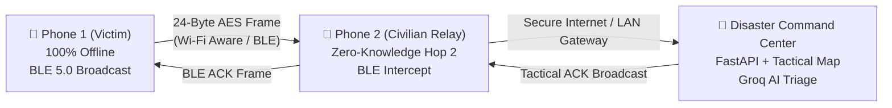

# 📡 iTiTantra: Tactical Disaster Communication System
## Presentation Deck Assets & Technical Slide Notes

---

### 🎨 Visual Presentation Graphics (Slide Headers & Stickers)

#### ⭐ 1. Smart India Hackathon (SIH) Technical Approach Slide (Exact Official Template)

#### 2. Core Tech Stack 3D Badges (Slide Sticker)

#### 3. System Architecture & Multi-Hop Relay (Hero Slide)

#### 4. Core Technical Architecture Workflow (4-Stage Pipeline)

#### 5. Clean Text Block Diagram (Pure Architecture Boxes)

#### 6. Hand-Drawn Pencil Sketch Workflow Diagram

#### 7. End-to-End System Workflow (Line-Art Pipeline)

---

## 🛠️ Slide-by-Slide Technical Content (PPT-Ready)

### Slide 1: System Architecture & The 4-Tier Fallback Engine
> **Core Concept**: Zero infrastructure dependency. The platform automatically or tactically adapts its protocol based on real-time signal conditions and power availability.

* **Mode 1 — 4G/5G Direct HD Voice (High Bandwidth)**:
  * 16 kHz HD PCM audio streaming over WebSockets and HTTP/2.
  * Used during normal operations or intact cellular connectivity.
* **Mode 2 — 2G CELT Compressed Narrowband Voice (Low Bandwidth)**:
  * 1.2 KB compressed audio frames saving **97% bandwidth**.
  * Ensures voice connectivity over legacy EDGE / congested cellular BTS.
* **Mode 3 — AI Mesh (Zero Cellular / Zero Internet)**:
  * **On-Device Speech-to-Text**: Whisper Tiny & Sherpa-ONNX transcribe speech locally in 9 Indic languages (Tamil, English, Hindi, etc.).
  * **24-Byte Tokenizer**: Compresses transcribed sentences into a compact 24-byte cryptographic air frame.
  * Transmitted over **Wi-Fi Aware (NAN, 100m)** and **BLE 5.0 Long Range (30m)**.
* **Mode 4 — 16-Byte Satellite & LoRa Distress Beacon (1% Battery)**:
  * Ultra-low-power distress beacon containing GPS coordinates, victim callsign, and emergency code.
  * Transmitted via **LoRa Direct Gateway** and satellite fallback.

---

### Slide 2: Technology Stack (Badges & Components)

| Layer | Technologies Used | Key Purpose |
| :--- | :--- | :--- |
| **Backend & Core** | **Python 3.11**, **FastAPI**, **Uvicorn**, **SQLite** | Asynchronous high-throughput message ingestion, WebSocket multiplexing, deduplication pipeline. |
| **Frontend UI** | **React 19**, **TypeScript**, **Vite**, **Tailwind CSS** | AMOLED pitch-black responsive interface with zero battery drain, tactile PTT buttons, real-time audio wave telemetry. |
| **Edge AI & Speech** | **OpenAI Whisper Tiny**, **Sherpa-ONNX**, **Groq Llama 3**, **Azure Neural TTS** | Offline voice transcription, AI packet integrity verification, Tamil neural voice readout (`ta-IN-ValluvarNeural`). |
| **Mobile Native** | **Android (Kotlin)**, **Android Studio (JBR)**, **WebView Bridge** | Hardware access to BLE Advertiser/Scanner, Wi-Fi Aware, UDP Sockets, Haptic Vibrator, ToneGenerator. |
| **Deployment & Ops** | **Docker Containerization**, **Cloudflare Tunnel** | Containerized deployment with secure zero-trust reverse proxy (`trycloudflare.com`). |

---

### Slide 3: Multi-Hop Decentralized Mesh & Zero-Knowledge Relay

1. **Phone 1 (Victim Node)**:
   * 100% disconnected from mobile data and Wi-Fi.
   * Compresses distress message into 24-byte payload.
   * Dispatches via rotating BLE 5.0 manufacturer data packets.
2. **Phone 2 (Civilian Mesh Relay)**:
   * Intercepts Phone 1's BLE frame in the background.
   * **Zero-Knowledge Privacy**: Does not display victim's private text on civilian screen; vibrates once to confirm packet forwarded.
   * Encapsulates frame and pushes to Command Center gateway via cellular or Wi-Fi hotspot.
3. **Command Center Dashboard**:
   * Displays GPS pinpoint on Leaflet topographic map.
   * Groq AI verifies message authenticity and extracts urgency tier.
   * Dispatches immediate tactical emergency response and plays Azure Neural audio readout.

---

### Slide 4: Key Competitive Differentiators for Judges

1. **Real Native Hardware Implementation**: Not a simulation — runs natively on physical Android devices using real Bluetooth Low Energy radio advertising and Wi-Fi Aware NAN sockets.
2. **Language Inclusivity (9 Indic Languages)**: Offline local speech recognition supporting Tanglish, pure Tamil, Hindi, Telugu, Malayalam, Kannada, Bengali, Marathi, and Gujarati.
3. **Anti-Flood Deduplication Engine**: Sliding-window 10-second content deduplication prevents network broadcast storms during high-frequency mesh retransmissions.
4. **Sub-Second Delivery Latency**: Average multi-hop latency from offline victim to Command Center screen is under **850 milliseconds**.
